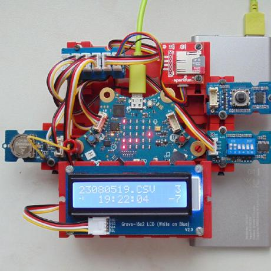

### Calliope i2c Demo mit vier i2c Modulen gleichzeitig, lädt alle i2c Erweiterungen von GitHub

> Diese Seite bei [https://calliope-net.github.io/i2c-test/](https://calliope-net.github.io/i2c-test/) öffnen

### Dieses Projekt importieren, mit Calliope testen, bearbeiten

Um dieses Repository in MakeCode zu importieren.

* öffne https://makecode.calliope.cc
* klicke auf **Importieren** und dann auf **Importiere URL**
* füge **https://github.com/calliope-net/i2c-test** ein und klicke auf Importieren

#### mit dem DIP Schalter wird eingestellt:

* Schalter 1 OFF: LCD Display zeigt Datum und Uhrzeit an (dauerhaft jede Sekunde)
  * solange Knopf B gedrückt: zeigt den Zustand der 6 DIP Schalter binär am LCD Display an
* Schalter 1 ON: aller 10 Sekunden wird eine Zeile auf die Speicherkarte protokolliert
  * Dateiname ergibt sich aus Datum/Zeit yyMMddHH.CSV (pro Stunde eine neue Datei)
  * Inhalt der Zeile: Dateiname; Datum; Zeit; DIP-Schalter binär; Temperatur; DrehungX; DrehungY; HardwareInterrupt; RGB
  * aktueller Dateiname und Zeit (aller 10 Sekunden wenn Zeile geschrieben) wird auf LCD Diaplay angezeigt
  * schreiben auf Speicherkarte kann zum Langzeit-Test der i2c Funktion genutzt werden
* Schalter 2 ON 3 OFF: LED-Matrix zeigt binär Uhrzeit (Stunde, Minute 10^1, Minute 10^0, Sekunde 10^1, Sekunde 10^0)
* Schalter 2 ON 3 ON: LED-Matrix zeigt binär Datum (Tag, -, Monat, -, Jahr)
* Schalter 2 OFF 3 ON: LED-Matrix löschen
* Schalter 4-5-6: Hintergrundfarbe, wenn ein Display mit 'Backlight' angeschlossen ist

> Einmalig Knopf A+B geklickt schaltet zusätzlich den Lagesensor (Drehung x- y-Achse) an, dieser hängt auch am i2c Bus.
> Danach werden im Sekundentakt die x und y Winkel im LCD Display rechts angezeigt (und auf Speicherkarte protokolliert).

> Der Sekundentakt kann von einer 'alle 1000 ms' Schleife kommen. Genauer geht es, wenn ein PIN mit CLK am RTC-Modul verdrahtet wird.
> Das wird erkennt und schaltet die Schleife ab. Ein Symbol wird links unten angezeigt.

> Auf dem LCD Display haben verschiedene Funktionen einen eigenen Bereich, ohne sich zu überschreiben.

#### 6 Erweiterungen werden automatisch mit geladen

* https://github.com/calliope-net/bit
* https://github.com/calliope-net/i2c
* https://github.com/calliope-net/dip-switch
* https://github.com/calliope-net/lcd16x2rgb
* https://github.com/calliope-net/log-qwiicopenlog
* https://github.com/calliope-net/rtc-pcf85063tp

#### Metadaten (verwendet für Suche, Rendering)

* Calliope mini
* i2c
