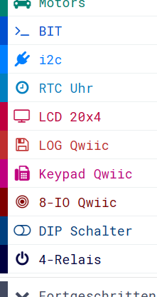

Diese Seite bei [https://calliope-net.github.io/i2c-test/](https://calliope-net.github.io/i2c-test/) öffnen.

### i2c Module an Calliope anstecken

* [Grove - High Precision RTC (Real Time Clock)](https://wiki.seeedstudio.com/Grove_High_Precision_RTC/)
* [SparkFun 20x4 SerLCD - RGB Backlight (Qwiic)](https://www.sparkfun.com/products/16398)
* [SparkFun Qwiic OpenLog](https://www.sparkfun.com/products/15164)
* [SparkFun Qwiic Keypad - 12 Button](https://www.sparkfun.com/products/15290)
* [SparkFun Qwiic GPIO](https://www.sparkfun.com/products/17047)
* [Grove - 6-Position DIP Switch](https://wiki.seeedstudio.com/Grove-6-Position_DIP_Switch/)
* [Grove - 4-Channel SPDT Relay](https://wiki.seeedstudio.com/Grove-4-Channel_SPDT_Relay/)

Kabel und Adapter

* [Grove - I2C Hub(6 Port)](https://wiki.seeedstudio.com/Grove-I2C-Hub-6Port/)
* [Qwiic Cable - Grove Adapter](https://www.sparkfun.com/products/15109)
* [Qwiic Cable Kit](https://www.sparkfun.com/products/15081)

Alle i2c Module werden parallel am linken Grove Steckverbinder A0 angeschlossen. Dazu kann ein i2c-Hub benutzt werden.
i2c Module mit zwei Buchsen (z.B. Qwiic) können hintereinander gesteckt werden.

Für die Stromversorgung sollte Calliope über USB Kabel (an Computer oder Powerbank) angeschlossen sein.

### .hex-Datei direkt auf Calliope laden, oder in MakeCode importieren.

* [mini-i2c-test.hex](mini-i2c-test.hex)
* [Schnappschuss (Bildschirmfoto mit den Blöcken)](mini-i2c-test.png)

Dieses Beispiel [in MakeCode öffnen](https://makecode.calliope.cc/_LayTV7RoDT6M).

#### Dieses Projekt von GitHub importieren, bearbeiten, mit Calliope testen.

Um dieses Repository in MakeCode zu importieren.

* öffne [https://makecode.calliope.cc](https://makecode.calliope.cc/)
* klicke auf **Importieren** und dann auf **Importiere URL**
* kopiere die folgende **URL des Projekts** in die Zwischenablage (Strg-C)
* **calliope-net/i2c-test**
* füge sie auf der MakeCode Webseite ein (Strg-V) und klicke auf **Los geht's!**

### Beschreibung der Calliope-App 'i2c-test' und Hardware.

Im Test funktionierten 7 Module gleichzeitig. Nur das Modul 'Grove - 16x2 LCD' funktionierte nicht mit allen anderen zusammen und wurde deshalb weg gelassen.
Es kann aber anstatt des großen 20x4 LCD Moduls verwendet werden.

[Qwiic](https://www.sparkfun.com/qwiic) Module (das sind die roten mit den kleinen Steckern) haben **immer** einen i2c Anschluss und 3,3 V Logik. Damit passt jedes Qwiic Modul grundsätzlich zum Calliope. 
Es sind keine Kabel beigelegt, deshalb den [Qwiic Cable - Grove Adapter](https://www.sparkfun.com/products/15109) mit bestellen. 
Für mehrere Qwiic Module eignet sich das [Qwiic Cable Kit](https://www.sparkfun.com/products/15081).
Die Software für die ersten vier Qwiic Module steht jetzt zur Verfügung. Mehr Erweiterungen sind geplant...

Das Modul mit den **4 Relais** wird auch an den i2c Bus angesteckt. Es funktioniert mit 3,3 V Logik, braucht aber für die Relais 5 Volt. Diese Spannung wird aus dem USB Anschluss genommen.
**Achtung!** Der rote Draht (+Pol) muss vom Grove-Stecker getrennt werden, wenn externe Spannung eingespeist wird. Nur der schwarze Draht (-Pol GND) muss verbunden werden.
**Qwiic geht bei 5 Volt kaputt!**

Damit mehrere i2c Module am selben Bus funktionieren, darf sie die Software nur nach einander ansteuern. 
Das heißt, bei MakeCode dürfen i2c Erweiterungen nur aus einem einzigen Ereignis (aus dem selben Thread) aufgerufen werden.
Der Verkehr auf dem Bus sollte reduziert werden, indem das selbe Register nur einmal im Intervall eingelesen wird.
Damit können die Module über den i2c Bus auch keine Interrupts auslösen. 
Ein Hintergrund Thread, der den Status abfragt, oder eine Laufschrift realisiert, führt dazu, dass sich der i2c Bus nach wenigen Minuten aufhängt.

**Hardware-Interrupt** wird von Modulen unterstützt, von denen eine Eingabe kommt (Uhr, Keypad, GPIO-input). Dazu muss der INT Anschluss vom Modul zu einem Calliope-Pin verdrahtet werden.
Der Pin kann dann einen Interrupt auslösen, der geht nämlich direkt an den Prozessor.
Allerdings: Es darf auch nur ein Pin-Ereignis geben und dann keine *dauerhaft* oder *alle .. ms Schleife*! In diesem Beispiel löst der Sekundentakt vom Uhr-Modul das Ereignis *pins.onPulsed* aus. 
Im Bild ist ein gelber Draht von CLK zu P1 zu erkennen. CLK muss dazu auf 1 Hz programmiert werden.

**GPIO** bedeutet: 'General-purpose input/output'. Das Modul hat 8 einzeln programmierbare digitale Ein- oder Ausgänge. 
Die restlichen 8 Klemmen sind 4xGND, 3x3V3 und der Interrupt hat eine Klemme, damit nicht gelötet werden muss.
Der Interrupt wird ausgelöst, wenn sich ein Eingang geändert hat. Es funktioniert nur mit Pull-up: *ziehe den Pin .. auf nach oben*.
Der Strom am Ausgang reicht für Leuchtdioden mit Vorwiderstand! [Ein Beispiel mit 7-Segment-Anzeige.](https://calliope-net.github.io/i2c-keypad-gpio-7segment/)
Es können bis zu 8 Qwiic GPIO Module hintereinander gesteckt und damit 64 digitale Ein- Ausgänge programmiert werden. Mit einem Calliope!
Die i2c Adresse kann durch Kratzen auf der Leiterplatte geändert werden.

Mit den **KeyPad** Tasten 0-9 werden (binär) die 4 Relais geschaltet und gleichzeitig die am GPIO Modul angeklemmten 4 Leuchtdioden (mit eingebautem Vorwiderstand). 
Vom Keypad wird (in dem Pin Ereignis von der Uhr) einmal pro Sekunde die zuerst gedrückte (und noch nicht abgeholte) Taste abgefragt. 
Werden mehrere Tasten pro Sekunde gedrückt, merkt sich das KeyPad diese und gibt sie in den folgenden Sekunden ab.

Auf dem **20x4 LCD Display** haben verschiedene Funktionen einen eigenen Bereich, ohne sich zu überschreiben. Das gesamte Display wird in jedem Sekunden- Intervall neu geschrieben.

* Zeile 0: Datum; Stellung der 6 DIP-Schalter (binär)
* Zeile 1: Status der Speicherkarte; Zeit; Drehung um y-Achse; Drehung um x-Achse
  * Der im Calliope integrierte Lagesensor ist auch am i2c Bus angeschlossen.
* Zeile 2: Suchstring 'wildcard' für Dateien; Index des aktuellen Dateiname im Array
* Zeile 3: aktueller Dateiname; Datei-Größe in Bytes

In jedem Sekunden- Intervall wird die Größe der aktuellen Datei von der Speicherkarte abgefragt und auf den nächsten Dateiname weiter geschaltet.
Sind max. 16 Dateinamen abgearbeitet, erfolgt ein neues Einlesen anhand der 'wildcard'. 
Mit Knopf A/B kann die 'wildcard' geändert werden: \*.* \*.TXT LOG\*.TXT \*.LOG \*/

Die Blöcke in dem einen Ereignis rufen nacheinander 7 verschiedene Module am selben i2c Bus auf. Das wiederholt sich jede Sekunde.

Unerwartet positiv ist, dass der Stromverbrauch und auch die Spannung an dem einen Grove Anschluss A0 am Calliope für alle Module ausreicht - wenn der Calliope über das USB Kabel mit Strom versorgt wird.
Auch der Programmcode von 10 gleichzeitig geladenen Erweiterungen verursacht keine Probleme. MakeCode kompiliert und überträgt es zum Calliope (natürlich mit dem Uploader).
Die Erweiterungen sind **nicht** auf Calliope 2.x eingestellt, sollten auch mit 1.x laufen. Getestet wurde mit Calliope 2.1.

### Erweiterungen

Die Calliope-App 'i2c-test' lädt folgende Erweiterungen:

Erweiterung für MakeCode|Blöcke zur Programmierung der Module
---|---
[calliope-net/bit](https://calliope-net.github.io/bit/) | Blöcke für HEX-Zahlen, bitweise Logik
[calliope-net/i2c](https://calliope-net.github.io/i2c/) | Blöcke für *Buffer*, i2c Programmierung
[calliope-net/rtc-uhr](https://calliope-net.github.io/rtc-uhr/) | Quarz-Uhr mit Knopfzelle
[calliope-net/lcd-20x4](https://calliope-net.github.io/lcd-20x4/) | LCD-Display 20 Zeichen x 4 Zeilen
[calliope-net/openlog](https://calliope-net.github.io/openlog/) | Speicherkarte lesen/schreiben
[calliope-net/keypad](https://calliope-net.github.io/keypad/) | Keypad Tasten: 0123456789*#
[calliope-net/gpio](https://calliope-net.github.io/gpio/) | 8 digitale Ein- oder Ausgänge (Input/Output)
[calliope-net/dip-switch](https://calliope-net.github.io/dip-switch/) | 6 DIP-Schalter oder '5-Way_Switch'
[calliope-net/spdt-relay](https://calliope-net.github.io/spdt-relay/) | 4 Relais (1-polige Umschalter) + zusätzliche Spannung 5V

#### Erweiterungen für i2c Hardware-Module

* [https://github.com/calliope-net/rtc-uhr](https://calliope-net.github.io/rtc-uhr/)
* [https://github.com/calliope-net/lcd-20x4](https://calliope-net.github.io/lcd-20x4/)
* [https://github.com/calliope-net/openlog](https://calliope-net.github.io/openlog/)
* [https://github.com/calliope-net/keypad](https://calliope-net.github.io/keypad/)
* [https://github.com/calliope-net/gpio](https://calliope-net.github.io/gpio/)
* [https://github.com/calliope-net/dip-switch](https://calliope-net.github.io/dip-switch/)
* [https://github.com/calliope-net/spdt-relay](https://calliope-net.github.io/spdt-relay/)

> [Upates für Erweiterungen; Erweiterungen aus einem Projekt löschen.](https://calliope-net.github.io/i2c-liste#updates)

> [Alle i2c-Erweiterungen für MakeCode von calliope-net (Software).](https://calliope-net.github.io/i2c-liste#erweiterungen)

#### Calliope-Apps, .hex-Dateien, Bildschirmfotos mit Blöcken

> [Alle Beispiel-Projekte für MakeCode von calliope-net (Calliope-Apps).](https://calliope-net.github.io/i2c-liste#programmierbeispiele)

> GitHub-Profil calliope-net: [https://github.com/calliope-net](https://github.com/calliope-net)

### Bezugsquellen

> [Alle i2c-Module und Bezugsquellen (Hardware).](https://calliope-net.github.io/i2c-liste#bezugsquellen)

#### Metadaten (verwendet für Suche, Rendering)

* Calliope mini
* i2c
