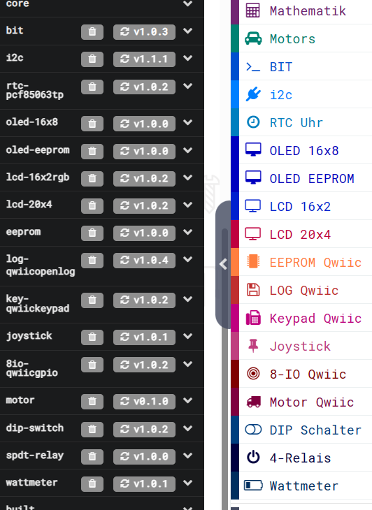

Diese Seite bei [https://calliope-net.github.io/i2c-test/](https://calliope-net.github.io/i2c-test/) öffnen.

Dieses Beispiel in MakeCode [https://makecode.calliope.cc/_RFD2qFYJe2Ps](https://makecode.calliope.cc/_RFD2qFYJe2Ps) öffnen.

### i2c Module an Calliope anstecken.

* [Grove - High Precision RTC (Real Time Clock)](https://wiki.seeedstudio.com/Grove_High_Precision_RTC/)
* [Grove - 16x2 LCD](https://wiki.seeedstudio.com/Grove-16x2_LCD_Series/)
* [SparkFun 20x4 SerLCD - RGB Backlight (Qwiic)](https://www.sparkfun.com/products/16398)
* [SparkFun Qwiic OpenLog](https://www.sparkfun.com/products/15164)
* [SparkFun Qwiic Keypad - 12 Button](https://www.sparkfun.com/products/15290)
* [SparkFun Qwiic GPIO](https://www.sparkfun.com/products/17047)
* [Grove - 6-Position DIP Switch](https://wiki.seeedstudio.com/Grove-6-Position_DIP_Switch/) / [Grove - 5-Way Switch](https://wiki.seeedstudio.com/Grove-5-Way_Switch/)
* [Grove - 4-Channel SPDT Relay](https://wiki.seeedstudio.com/Grove-4-Channel_SPDT_Relay/)

Kabel und Adapter

* [Grove - I2C Hub(6 Port)](https://wiki.seeedstudio.com/Grove-I2C-Hub-6Port/)
* [Qwiic Cable - Grove Adapter](https://www.sparkfun.com/products/15109)
* [Qwiic Cable Kit](https://www.sparkfun.com/products/15081)

Alle i2c Module werden parallel am linken Grove Steckverbinder A0 angeschlossen. 
Dazu kann ein [i2c-Hub](https://wiki.seeedstudio.com/Grove-I2C-Hub-6Port/) benutzt werden.
i2c Module mit zwei Buchsen (z.B. Qwiic) können hintereinander gesteckt werden.

Für die Stromversorgung sollte Calliope über USB Kabel (an Computer oder Powerbank) angeschlossen sein.

#### .hex-Datei direkt auf Calliope laden, oder in MakeCode importieren.

* [mini-i2c-test.hex](mini-i2c-test.hex)
* [Schnappschuss (Bildschirmfoto mit den Blöcken)](mini-i2c-test.png)

#### Dieses Projekt von GitHub importieren, bearbeiten, mit Calliope testen.

Um dieses Repository in MakeCode zu importieren.

* öffne [https://makecode.calliope.cc](https://makecode.calliope.cc/)
* klicke auf **Importieren** und dann auf **Importiere URL**
* kopiere die folgende **URL des Projekts** in die Zwischenablage (Strg-C)
* **calliope-net/i2c-test**
* füge sie auf der MakeCode Webseite ein (Strg-V) und klicke auf **Los geht's!**

### Beschreibung der 'Calliope-i2c-Test-App' und Hardware.

> Update: Im Sep 2023 sind 4 neue i2c-Erweiterungen dazu gekommen: EEPROM, Joystick, Motor, Wattmeter.
> Die Beschreibung ist vom Stand August.

Im Test funktionierten 7 Module gleichzeitig. Nur das Modul 'Grove - 16x2 LCD' funktionierte nicht mit allen anderen zusammen und wurde deshalb weg gelassen.
Es kann aber anstatt des großen 20x4 LCD Moduls verwendet werden.

[Qwiic](https://www.sparkfun.com/qwiic) Module (das sind die roten mit den kleinen Steckern) haben **immer** einen i2c Anschluss und 3,3 V Logik. Damit passt jedes Qwiic Modul grundsätzlich zum Calliope. 
Es sind keine Kabel beigelegt, deshalb den [Qwiic Cable - Grove Adapter](https://www.sparkfun.com/products/15109) mit bestellen. 
Für mehrere Qwiic Module eignet sich das [Qwiic Cable Kit](https://www.sparkfun.com/products/15081).
Die Software für die ersten vier Qwiic Module steht jetzt zur Verfügung. Mehr Erweiterungen sind geplant...

Das Modul mit den **4 Relais** wird auch an den i2c Bus angesteckt. Es funktioniert mit 3,3 V Logik, braucht aber für die Relais 5 Volt. Diese Spannung wird aus dem USB Anschluss genommen.
**Achtung!** Der rote Draht (+Pol) muss vom Grove-Stecker getrennt werden, wenn externe Spannung eingespeist wird. Nur der schwarze Draht (-Pol GND) muss verbunden werden.
**Qwiic geht bei 5 Volt kaputt!**

Damit mehrere i2c Module am selben Bus funktionieren, darf sie die Software nur nach einander ansteuern. 
Das heißt, bei MakeCode dürfen i2c Erweiterungen nur aus einem einzigen Ereignis (aus dem selben Thread) aufgerufen werden.
Der Verkehr auf dem Bus sollte reduziert werden, indem das selbe Register nur einmal im Intervall eingelesen wird.
Damit können die Module über den i2c Bus auch keine Interrupts auslösen. 
Ein Hintergrund Thread, der den Status abfragt, oder eine Laufschrift realisiert, führt dazu, dass sich der i2c Bus nach wenigen Minuten aufhängt.

**Hardware-Interrupt** wird von Modulen unterstützt, von denen eine Eingabe kommt (Uhr, Keypad, GPIO-input). Dazu muss der INT Anschluss vom Modul zu einem Calliope-Pin verdrahtet werden.
Der Pin kann dann einen Interrupt auslösen, der geht nämlich direkt an den Prozessor.
Allerdings: Es darf auch nur ein Pin-Ereignis geben und dann keine *dauerhaft* oder *alle .. ms Schleife*! In diesem Beispiel löst der Sekundentakt vom Uhr-Modul das Ereignis *pins.onPulsed* aus. 
Im Bild ist ein gelber Draht von CLK zu P1 zu erkennen. CLK muss dazu auf 1 Hz programmiert werden.

**GPIO** bedeutet: 'General-purpose input/output'. Das Modul hat 8 einzeln programmierbare digitale Ein- oder Ausgänge. 
Die restlichen 8 Klemmen sind 4xGND, 3x3V3 und der Interrupt hat eine Klemme, damit nicht gelötet werden muss.
Der Interrupt wird ausgelöst, wenn sich ein Eingang geändert hat. Es funktioniert nur mit Pull-up: *ziehe den Pin .. auf nach oben*.
Der Strom am Ausgang reicht für Leuchtdioden mit Vorwiderstand! [Ein Beispiel mit 7-Segment-Anzeige.](https://calliope-net.github.io/i2c-keypad-gpio-7segment/)
Es können bis zu 8 Qwiic GPIO Module hintereinander gesteckt und damit 64 digitale Ein- Ausgänge programmiert werden. Mit einem Calliope!
Die i2c Adresse kann durch Kratzen auf der Leiterplatte geändert werden.

Mit den **KeyPad** Tasten 0-9 werden (binär) die 4 Relais geschaltet und gleichzeitig die am GPIO Modul angeklemmten 4 Leuchtdioden (mit eingebautem Vorwiderstand). 
Vom Keypad wird (in dem Pin Ereignis von der Uhr) einmal pro Sekunde die zuerst gedrückte (und noch nicht abgeholte) Taste abgefragt. 
Werden mehrere Tasten pro Sekunde gedrückt, merkt sich das KeyPad diese und gibt sie in den folgenden Sekunden ab.

Auf dem **20x4 LCD Display** haben verschiedene Funktionen einen eigenen Bereich, ohne sich zu überschreiben. Das gesamte Display wird in jedem Sekunden- Intervall neu geschrieben.

* Zeile 0: Datum; Stellung der 6 DIP-Schalter (binär)
* Zeile 1: Status der Speicherkarte; Zeit; Drehung um y-Achse; Drehung um x-Achse
  * Der im Calliope integrierte Lagesensor ist auch am i2c Bus angeschlossen.
* Zeile 2: Suchstring 'wildcard' für Dateien; Index des aktuellen Dateiname im Array
* Zeile 3: aktueller Dateiname; Datei-Größe in Bytes

In jedem Sekunden- Intervall wird die Größe der aktuellen Datei von der Speicherkarte abgefragt und auf den nächsten Dateiname weiter geschaltet.
Sind max. 16 Dateinamen abgearbeitet, erfolgt ein neues Einlesen anhand der 'wildcard'. 
Mit Knopf A/B kann die 'wildcard' geändert werden: \*.* \*.TXT LOG\*.TXT \*.LOG \*/

Die Blöcke in dem einen Ereignis rufen nacheinander 7 verschiedene Module am selben i2c Bus auf. Das wiederholt sich jede Sekunde.

Unerwartet positiv ist, dass der Stromverbrauch und auch die Spannung an dem einen Grove Anschluss A0 am Calliope für alle Module ausreicht - wenn der Calliope über das USB Kabel mit Strom versorgt wird.
Auch der Programmcode von 10 gleichzeitig geladenen Erweiterungen verursacht keine Probleme. MakeCode kompiliert und überträgt es zum Calliope (natürlich mit dem Uploader).
Die Erweiterungen sind **nicht** auf Calliope 2.x eingestellt, sollten auch mit 1.x laufen. Getestet wurde mit Calliope 2.1.

### Erweiterungen

Die Erweiterungen **bit** und **i2c** (die mit 3 Buchstaben) enthalten nur zusätzliche Blöcke zur Formatierung von Text und Zahlen, Logik und zur Programmierung beliebiger i2c Module ohne JavaScript.
Diese Erweiterungen werden von den folgenden Erweiterungen für i2c Hardware-Module **nicht** benötigt. Jede Erweiterung kann von GitHub über **calliope-net/name** allein geladen werden.

* [https://github.com/calliope-net/bit](https://calliope-net.github.io/bit/)
* [https://github.com/calliope-net/i2c](https://calliope-net.github.io/i2c/)

#### Erweiterungen für i2c Hardware-Module

* [https://github.com/calliope-net/rtc-pcf85063tp](https://calliope-net.github.io/rtc-pcf85063tp/)
* [https://github.com/calliope-net/lcd-16x2rgb](https://calliope-net.github.io/lcd-16x2rgb/)
* [https://github.com/calliope-net/lcd-20x4](https://calliope-net.github.io/lcd-20x4/)
* [https://github.com/calliope-net/eeprom](https://calliope-net.github.io/eeprom/)
* [https://github.com/calliope-net/log-qwiicopenlog](https://calliope-net.github.io/log-qwiicopenlog/)
* [https://github.com/calliope-net/key-qwiickeypad](https://calliope-net.github.io/key-qwiickeypad/)
* [https://github.com/calliope-net/8io-qwiicgpio](https://calliope-net.github.io/8io-qwiicgpio/)
* [https://github.com/calliope-net/joystick](https://calliope-net.github.io/joystick/)
* [https://github.com/calliope-net/motor](https://calliope-net.github.io/motor/)
* [https://github.com/calliope-net/dip-switch](https://calliope-net.github.io/dip-switch/)
* [https://github.com/calliope-net/spdt-relay](https://calliope-net.github.io/spdt-relay/)
* [https://github.com/calliope-net/wattmeter](https://calliope-net.github.io/wattmeter/)

### Updates

In der **JavaScript** Ansicht links unter dem Simulator im schwarzen Explorer sind alle von dem Projekt geladenen Erweiterungen zu finden.
Um ein Update einer Erweiterung von GitHub zu laden, muss das Symbol mit dem runden Pfeil angeklickt werden.
Dabei kann es passieren, dass die Erweiterung nicht mehr mit dem eigenen Programm kompatibel ist und das Programm angepasst werden muss.
Deshalb werden Updates auch nicht automatisch geladen.

#### Erweiterungen aus vorhendenen Projekten löschen

Für eigene Entwicklungen auf Grundlage der Beispiel-Apps, oder wenn i2c Module fehlen, können nicht benötigte Erweiterungen gelöscht werden.
Dazu in der **JavaScript** Ansicht links unter dem Simulator im schwarzen Explorer auf den Mülleimer klicken.

### Programmierbeispiele

#### Calliope-Apps, .hex-Dateien, Bildschirmfotos mit Blöcken

* [Calliope-i2c-Test-App lädt alle Erweiterungen für i2c-Module von Grove und Qwiic.](https://calliope-net.github.io/i2c-test/)
* [Calliope-App mit vier i2c Modulen gleichzeitig, DIP-Schalter, Speicherkarte, LCD-Display, Uhr.](https://calliope-net.github.io/i2c-uhr-speicherkarte-dipschalter-lcd/)
* [Calliope-App Quarz-Uhr anzeigen, stellen mit Knopf A/B, Korrektur-Register, Binär-Uhr.](https://calliope-net.github.io/i2c-uhr-stellen/)
* [Calliope-App Dateien der Speicherkarte anzeigen, lesen, schreiben, löschen, mit Knopf A/B.](https://calliope-net.github.io/i2c-speicherkarte-verwalten/)
* [Calliope-App mit Keypad und IO-Modul eine 7-Segment-Anzeige steuern, Hardware-Interrupt.](https://calliope-net.github.io/i2c-keypad-gpio-7segment/)

> GitHub-Profil calliope-net: [https://github.com/calliope-net](https://github.com/calliope-net)

### Bezugsquellen

##### Grove - [seeed studio](https://wiki.seeedstudio.com/Grove_System/)

* [Grove - High Precision RTC](https://www.mouser.de/ProductDetail/713-102020083)
* [Grove - 16 x 2 LCD (White on Blue)](https://www.mouser.de/ProductDetail/713-104020111)
  * [Grove - 16 x 2 LCD (Black on Red)](https://www.mouser.de/ProductDetail/713-104020112)
  * [Grove - 16 x 2 LCD (Black on Yellow)](https://www.mouser.de/ProductDetail/713-104020113)
  * [Grove - LCD RGB Backlight](https://www.mouser.de/ProductDetail/713-104030001)
* [Grove - 6-Position DIP Switch](https://www.mouser.de/ProductDetail/713-111020043) zum Produkt-Bild vergrößern klicken
  * [Grove - 5-Way Switch](https://www.mouser.de/ProductDetail/713-111020048)
* [Grove - 4-Channel SPDT Relay](https://www.mouser.de/ProductDetail/713-103020133)
* [Gravity: I2C Digital Wattmeter](https://www.digikey.de/de/products/detail/dfrobot/SEN0291/10279750)

##### SparkFun Qwiic - [Making I2C as easy as possible.](https://www.sparkfun.com/categories/399)

* [SparkFun 20x4 SerLCD - RGB Backlight (Qwiic)](https://www.mouser.de/ProductDetail/474-LCD-16398)
  * [SparkFun 20x4 SerLCD - RGB Backlight (Qwiic)](https://www.digikey.de/de/products/detail/sparkfun-electronics/LCD-16398/13171324)
* [SparkFun Qwiic EEPROM Breakout - 512Kbit](https://www.digikey.de/de/products/detail/sparkfun-electronics/COM-18355/14825470)
* [SparkFun Qwiic OpenLog](https://www.mouser.de/ProductDetail/474-DEV-15164)
  * [SparkFun Qwiic OpenLog](https://www.digikey.de/de/products/detail/sparkfun-electronics/DEV-15164/9920435)
* [SparkFun Qwiic Keypad - 12 Button](https://www.mouser.de/ProductDetail/474-COM-15290)
  * [SparkFun Qwiic Keypad - 12 Button](https://www.digikey.de/de/products/detail/sparkfun-electronics/COM-15290/10130913)
* [SparkFun Qwiic GPIO](https://www.mouser.de/ProductDetail/474-DEV-17047)
  * [SparkFun Qwiic GPIO](https://www.digikey.de/de/products/detail/sparkfun-electronics/DEV-17047/13419022)
* [SparkFun Qwiic Joystick](https://www.digikey.de/de/products/detail/sparkfun-electronics/COM-15168/9953917)
* [SparkFun Qwiic Motor Driver](https://www.digikey.de/de/products/detail/sparkfun-electronics/ROB-15451/10483247)

##### Grove Kabel und i2c Hub

* [Grove - Universal 4 Pin Buckled 5cm Cable (5 PCs Pack)](https://www.mouser.de/ProductDetail/713-110990036)
* [Grove-Kabel 10 cm (5 Stk./Set)](https://www.conrad.de/de/p/m5-stack-a034-a-kabel-5-st-passend-fuer-entwicklungskits-arduino-2373098.html)
* [Grove - Universal 4 Pin Buckled 40cm Cable (5 PCs Pack)](https://www.mouser.de/ProductDetail/713-110990064)
* [Grove - Universal 4 Pin Buckled 50cm Cable (5 PCs Pack)](https://www.mouser.de/ProductDetail/713-110990038)
* [Grove-Kabel 100 cm](https://www.conrad.de/de/p/m5-stack-a034-d-kabel-1-st-2306328.html)
* [Grove-Kabel 200 cm](https://www.conrad.de/de/p/m5-stack-a034-e-kabel-1-st-passend-fuer-entwicklungskits-arduino-2306329.html)
* [Grove - I2C Hub (4 Port)](https://www.mouser.de/ProductDetail/713-103020006)
  * [Grove - I2C Hub (4 Port)](https://www.digikey.de/de/products/detail/seeed-technology-co-ltd/103020006/5487896)
* [Grove - I2C Hub (6 Port)](https://www.mouser.de/ProductDetail/713-103020272)

##### Qwiic i2c Kabel und Adapter

* [Qwiic Cable - Grove Adapter (100mm)](https://www.mouser.de/ProductDetail/474-PRT-15109)
* [Qwiic Cable Kit](https://www.mouser.de/ProductDetail/474-KIT-15081)
* [Qwiic Adapter](https://www.mouser.de/ProductDetail/474-DEV-14495)
* [Qwiic MultiPort](https://www.mouser.de/ProductDetail/474-BOB-18012)
  * [Qwiic MultiPort](https://www.digikey.de/de/products/detail/sparkfun-electronics/BOB-18012/13998109)

#### Metadaten (verwendet für Suche, Rendering)

* Calliope mini
* i2c
